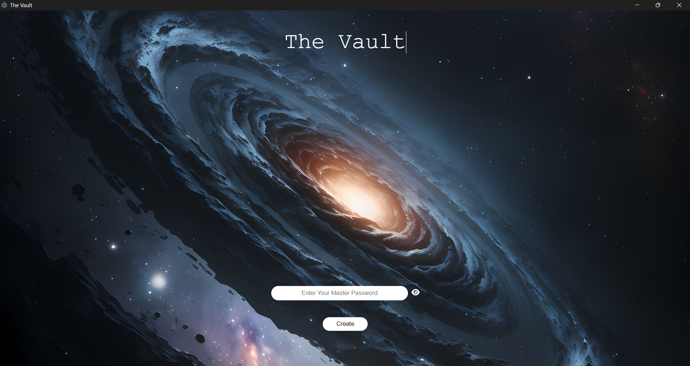
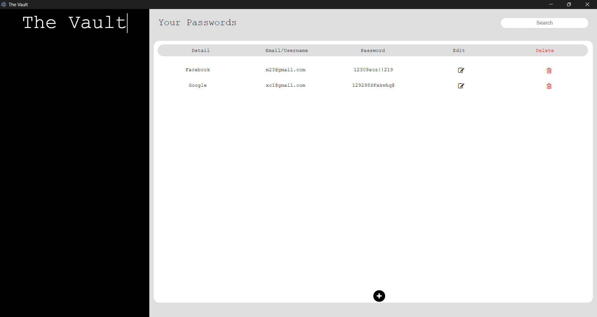

# The Vault

## Preview

## Overview

The Vault is a modern and secure application designed to help users manage their passwords efficiently. The system provides a user-friendly interface with a sleek, modern design that prioritizes ease of use, security, and functionality. This tool enables users to create, store, edit, delete, and search for passwords in a secure environment.

## Usage 

- create a .env file

- create a secret key that will be your encryption key (Follow .env.example file format)

- run the following command in the terminal : npm start run

> [!CAUTION]
> Do not share your secret key with anyone

## How does it work?

If a master password exists it will ask you to enter it.

Else If it's your first time using the app it will ask you to create a master password.

A Sqlite DB will be create where all your passwords details are in it encrypted with the secret key in the .env file.

Once you are in the app you can use the following functionalities:

1. Create a Password
2. Edit an existing Password
3. Delete an existing Password
4. Search for a password/certain text in the passwords table

## How to package?

npx electron-packager . the-vault --overwrite --asar --platform={specific_platform} --arch={specific_arch} --prune=true --out=release-builds --icon={icon_path}

> [!NOTE]
> There is a bug with .env files while packaging the app, you have to navigate to utils/security/encryption.js and change the secret key to a hard coded secret key

## Contributions
Contributions are welcome! If you find any bugs or want to add new features, please open an issue or create a pull request.

## License
This project is licensed under the MIT License - see the LICENSE file for details.
